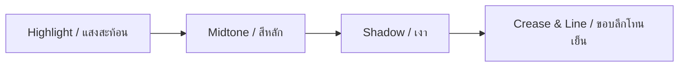
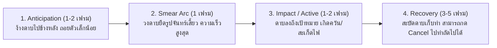

# การวิเคราะห์โครงสร้างดีไซน์และระบบอนิเมชัน: Merakintsugi Platformer Character Pack
> **วัตถุประสงค์:** เอกสารวิเคราะห์เชิงลึกสำหรับใช้เป็น Design Specification & Master Prompt ในการให้ Claude ออกแบบตัวละคร 2D Pixel Art ใหม่ในสไตล์และมาตรฐานคุณภาพเดียวกัน

---

## 1. ภาพรวมสไตล์และเอกลักษณ์ (Art Style Overview)

* **ประเภทสไตล์:** **High-End 16-bit / 32-bit Neo-Retro Action RPG** (คล้ายเกมอย่าง *Katana Zero, Dead Cells, Skul: The Hero Slayer, Momodora*)
* **จุดเด่นเฉพาะตัว (Signature Traits):**
  1. **สัดส่วนกึ่ง Chibi Action (Semi-Chibi):** ขนาดกะทัดรัดแต่ไม่อ้วนป้อม เน้นความปราดเปรียวและอ่านท่าทาง (Readability) ชัดเจนจากระยะไกล
  2. **Fluid Physics & Secondary Motion:** เส้นผม เสื้อคลุม และผ้าพันคอมีการเคลื่อนไหวพริ้วไหวตามแรงเฉื่อย (Inertia & Follow-through) ทุกเฟรม
  3. **Smear Frame & Slash VFX:** ใช้เส้นสปีดรูปทรงพระจันทร์เสี้ยว (Solid Crescent Blade Arcs) ที่คมชัด ไม่เบลอ เพื่อสร้างแรงปะทะที่หนักแน่น
  4. **สถาปัตยกรรมแยกเลเยอร์ (Decoupled Layer Architecture):** แอนิเมชันตัวละคร (Body) และเอฟเฟกต์ฟัน/ควัน (VFX) แยกเลเยอร์กันชัดเจนในไฟล์ Aseprite

---

## 2. ข้อมูลจำเพาะทางเทคนิค (Technical Specifications)

| พารามิเตอร์ | ค่ามาตรฐานของโปรเจกต์ | หมายเหตุสำหรับนำไปใช้ |
| :--- | :--- | :--- |
| **Aseprite Canvas Size** | **64 × 64 pixels** (Idle) / **53 × 64 pixels** (Walk) | พื้นที่แคนวาสพื้นฐานสำหรับท่าปกติ |
| **Combo / VFX Canvas** | ขยายได้ถึง **96 × 96** หรือ **128 × 128 pixels** | จำเป็นสำหรับท่าที่มีวงดาบกว้างหรือพุ่งตัว |
| **Character Hitbox Dimensions** | กว้าง ~**24–32 px**, สูง ~**40–46 px** | ตัวละครสูงประมาณ 70% ของความสูงแคนวาส 64px |
| **Portrait Resolution** | **64 × 96 pixels** (Native) → ขยาย 256×384 (Preview) | อัตราส่วน 2:3 สำหรับ UI กล่องข้อความ/หน้าสถานะ |
| **Color Depth** | **32 bpp RGBA** (True color พร้อมช่อง Alpha โปร่งใส) | รองรับความโปร่งใสและควันฟุ้ง |
| **Frame Rates (FPS)** | **15 – 24 FPS** (Animation Frame Delay: ~40ms – 70ms) | ปรับสปีดเร็ว-ช้าแบบ Dynamic ไม่เท่ากันทุกเฟรม |

---

## 3. สัดส่วนและกายวิภาคตัวละคร (Character Anatomy & Proportions)

```
        ┌─────────────┐
        │ [1.0 Head]  │  ~16-18 px  (ใบหน้า ดวงตา เขา/ที่คาดผม กลุ่มผมหนา)
        ├─────────────┤
        │ [1.0 Torso] │  ~14-16 px  (ลำตัว เสื้อคลุม เข็มขัด ด้ามดาบ)
        ├─────────────┤
        │ [1.0 Legs]  │  ~14-16 px  (กางเกง รองเท้าบู้ททรงตันยึดพื้น)
        └─────────────┘
  สัดส่วนรวม: 1 : 2.5 ถึง 1 : 3 หัวต่อตัว (Chibi Heroic Scale)
```

1. **ส่วนหัว (Head & Hair):**
   * ใบหน้าเน้นจุดเด่นที่ **ดวงตาสว่าง 1-2 พิกเซล** และทรงผมก้อนใหญ่ที่แบ่งชั้นชัดเจน (Hair clumps)
   * มี Accessory เด่น เช่น เขา (Horns) หรือผ้าผูกผม เพื่อให้จำ Silhouette ได้ทันที
2. **ส่วนลำตัวและชุด (Torso & Costume):**
   * ท่อนบนสวมเสื้อกิโมโน/เสื้อคลุมสั้น มีเข็มขัดหรือผ้าคาดเอวสีตัดกัน เพื่อแบ่งท่อนบน-ท่อนล่างชัดเจน
   * ชายเสื้อคลุมสะบัดตามทิศทางการวิ่ง/ฟัน ช่วยบอกทิศทางความเร็ว (Vector indicator)
3. **อาวุธ (Weapon):**
   * ดาบมีความยาว **ยาวกว่าลำตัว** (ใบดาบ ~35–45 พิกเซล) เพื่อให้จังหวะฟันเกิดวงสวิงขนาดใหญ่และมองเห็นชัดเจน

---

## 4. โทนสีและระบบพาเลตต์ (Color Palette & Shading Architecture)

ชุดสีของต้นฉบับใช้เทคนิค **Hue Shifting** (เมื่อเงาเข้มขึ้น สีจะเอียงไปทางโทนเย็น เช่น น้ำเงิน/ม่วง):



### ตารางรหัสสีที่สกัดได้จากตัวละครต้นแบบ (Hex Palette)

| ชิ้นส่วน | แสงไฮไลต์ (Highlight) | สีกลาง (Midtone) | เงา (Shadow) | เส้นตัดลึก (Crease/Dark) |
| :--- | :--- | :--- | :--- | :--- |
| **ผม (Lilac / Lavender)** | `#FFFFFF` | `#B2B2FF` | `#9EA0FA` / `#40225F` | `#151037` / `#2F1850` |
| **ผิว (Warm Peach)** | `#FFFFCC` | `#FF8C5E` | `#A64B0A` | `#4D2F1E` / `#8C2309` |
| **เสื้อคลุม (Navy Indigo)** | `#0321BC` | `#1C154D` | `#151037` | `#0F121B` |
| **แถบคาด / ซับใน (Crimson)** | `#FF0E00` | `#882323` | `#580303` | `#370F31` |
| **เครื่องประดับทอง (Gold/Brass)**| `#FFFFCC` | `#FFA303` | `#E05E2B` | `#A64B0A` |
| **เอฟเฟกต์ฟัน (Energy Slash)** | `#FFFFFF` (แกนขาว) | `#97C0FF` (ฟ้าเรืองแสง) | `#0321BC` (ขอบพลัง) | `#1C154D` (ละอองสลาย) |

> [!TIP]
> **Selective Outlining (Sel-out):** ต้นฉบับไม่ใช้เส้นขอบดำล้วน (Black Outline) รอบตัวละคร แต่ใช้สีเงาเข้มสุดของชิ้นส่วนนั้นๆ (เช่น เงาผมใช้ม่วงเข้ม `#151037`, เงาเสื้อใช้น้ำเงินเกือบดำ `#0F121B`) ทำให้งานดูนุ่มนวลและกลืนกับฉากหลังของเกมได้ดีกว่า

---

## 5. การวิเคราะห์จังหวะอนิเมชันและเฟรม (Animation Pacing & Breakdown)

### 5.1 Idle Animation (ท่ายืนหายใจ)
* **จำนวนเฟรม:** 10 เฟรม (ลูปสมบูรณ์)
* **จังหวะเวลา:** เฟรมละ ~60ms รวม 600ms (~16.6 FPS)
* **โครงสร้างการขยับ:**
  * เฟรม 1–5: หายใจเข้า ลำตัวยืดขึ้น 1 พิกเซล ชายเสื้อและผมค่อยๆ ยกตัวขึ้นตาม
  * เฟรม 6–10: หายใจออก ลำตัวยุบลง 1 พิกเซล ผมทิ้งตัวลงตามแรงโน้มถ่วง

### 5.2 Walk & Transition (ท่าเดิน)
* **โครงสร้าง:** 2 เฟรม Transition (`from idle`) + 24 เฟรม Loop
* **จุดสังเกต:** มีจังหวะก้าวเท้าที่ยกเข่าสูงและลงส้นเท้าอย่างมั่นคง ลำตัวเอียงไปข้างหน้าเล็กน้อย 2–3 องศา

### 5.3 Combat System: 3-Hit & 5-Hit Combo (ระบบคอมโบ)
สูตรสำเร็จของการทำ Attack Animation สไตล์นี้แบ่งออกเป็น 4 ระยะเสมอ (Anticipation → Smear → Active → Recovery):



* **Hit 1 (Slash แนวนอน):** วงดาบโค้งหน้าตรง รวดเร็ว เฟรมค้างสั้นเพื่อความคล่องตัว
* **Hit 2 (Low Sweep / พุ่งเฉียง):** ตัวละครพุ่งไปข้างหน้า +8 ถึง +12 พิกเซล ใบดาบกวาดเฉียงขึ้น
* **Hit 3 (Overhead Heavy Finisher):** กระโดดฟันลงพื้น มีสะเก็ดพลังสีฟ้าและกลุ่มควันกระแทกพื้นสองฝั่ง (Symmetrical Shockwave)
* **Vertical Finisher (ท่าปักดาบลงพื้น):** ตัวละครทิ้งดิ่งลงพื้น มีเศษหินและลำแสงสีเขียว/ฟ้าพุ่งกระจายขึ้นด้านบน 6 แฉก

---

## 6. ตำแหน่งไฟล์ในโปรเจกต์

โครงสร้างไฟล์ทั้งหมดอยู่ใน `README.md` ที่ root ของโปรเจกต์ ส่วนที่เกี่ยวกับคู่มือนี้:

* `assets/sprites/` ไฟล์ `.aseprite` (idle 10 เฟรม, walk 26 เฟรม = from idle 2 + walk cycle 24) และ sprite sheet ต้นฉบับ
* `assets/reference/gifs/` GIF ตัวอย่างท่าของชุดเต็ม ผลวิเคราะห์ว่าแต่ละไฟล์มีท่าอะไรอยู่ใน `docs/moveset.md`
* `assets/reference/gif_timing.json` สถิติจังหวะเฟรมของ GIF แต่ละไฟล์
* `game/assets/sprites.json` atlas ที่เกมและ studio ใช้ร่วมกัน สร้างโดย `tools/build_sprites.py`

---

## 7. Claude Master Prompt: สำหรับส่งให้ Claude ออกแบบตัวละครใหม่

คุณสามารถคัดลอกข้อความด้านล่างนี้ไปวางในแชตของ Claude เพื่อให้ Claude ออกแบบตัวละครใหม่ตามสเปกนี้ได้ทันที:

````markdown
คุณคือ Pixel Art Art Director และ Lead 2D Animator ระดับมืออาชีพสำหรับเกม Action Platformer / Metroidvania 

ฉันต้องการให้ออกแบบตัวละครใหม่ โดยอิงตาม Technical Art & Animation Pipeline ของ "Merakintsugi Platformer Character Pack" ดังนี้:

### 1. Technical Constraints:
- Canvas ขนาด: 64x64 pixels (สำหรับ Base Actions) และขยายถึง 96x96 หรือ 128x128 pixels (สำหรับ Attack & VFX Slices)
- Character Height: 40–46 pixels (สัดส่วน 1:2.8 Semi-Chibi Action Scale)
- Color Technique: 3-4 tone ramp with Hue Shifting, Selective Outlining (ห้ามใช้ pure black outline)
- Architecture: ต้องแยกเลเยอร์ Character Body ออกจาก Attack FX เสมอ

### 2. ข้อมูลตัวละครใหม่ที่ต้องการ:
- ชื่อ/คอนเซปต์ตัวละคร: [ใส่คอนเซปต์ของคุณ เช่น นินจาสาวไซเบอร์พังก์ / จอมเวทดาบสายฟ้า / ซามูไรปีศาจ]
- อาวุธประจำตัว: [เช่น ดาบคาตานะยาว / เคียวคู่ / หอก / ดาบใหญ่เรืองแสง]
- ธีมสีหลัก (Primary & Secondary Colors): [เช่น ขาว-ทอง-น้ำเงิน หรือ ดำ-แดง-ม่วง]
- เอกลักษณ์ประจำตัว (Signature Silhouette): [เช่น ผ้าพันคอยาวสะบัด / หน้ากากจิ้งจอก / ปีกเงาข้างเดียว]

### 3. สิ่งที่ต้องการให้คุณส่งมอบ (Deliverables):
1. **Character Design Specification:**
   - Palette Table: รหัสสี Hex สำหรับผม, ผิว, เสื้อผ้า, อาวุธ, และ FX (Highlight, Midtone, Shadow, Dark Crease)
   - Pixel Grid Proportions: ความสูงของหัว, ลำตัว, ขา, และความยาวอาวุธในหน่วยพิกเซล
2. **Keyframe Breakdown & Pacing Table สำหรับ Action ต่อไปนี้:**
   - `Idle` (10 เฟรม loop พร้อมคำอธิบายการขยับของผมและลมหายใจ)
   - `Walk` (Transition 2 เฟรม + 24 เฟรม loop)
   - `3-Hit Combo Attack` (แจกแจงเฟรมแบบ Anticipation → Smear Arc → Active Impact → Recovery พร้อมทิศทางวงดาบ)
   - `Air Dash` (Squash & Stretch frames, After-image ghosting)
3. **VFX & Smear Frame Guide:**
   - รูปร่างของวงดาบ (Crescent smear arc) และสีของ Trail สำหรับอาวุธนี้
4. **Code / Prompt Generator:**
   - Prompt สำหรับสร้าง Concept Art / Sprite Sheet ในเครื่องมือ AI หรือคำแนะนำในการวาดลงบนโปรแกรม Aseprite ทีละเลเยอร์
````
