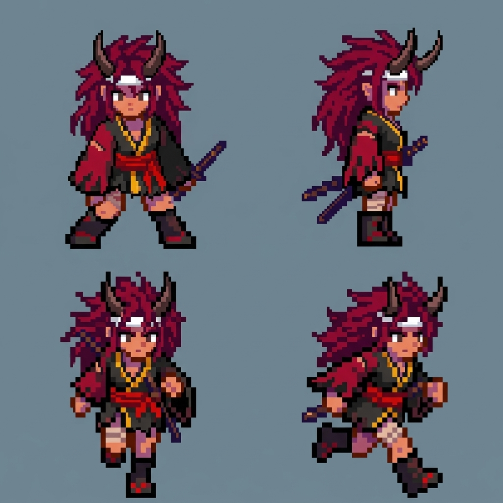
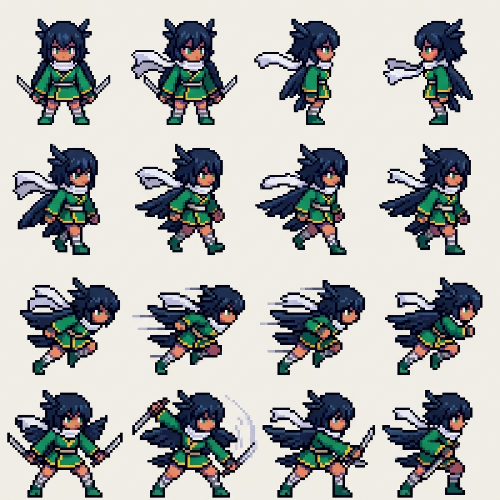
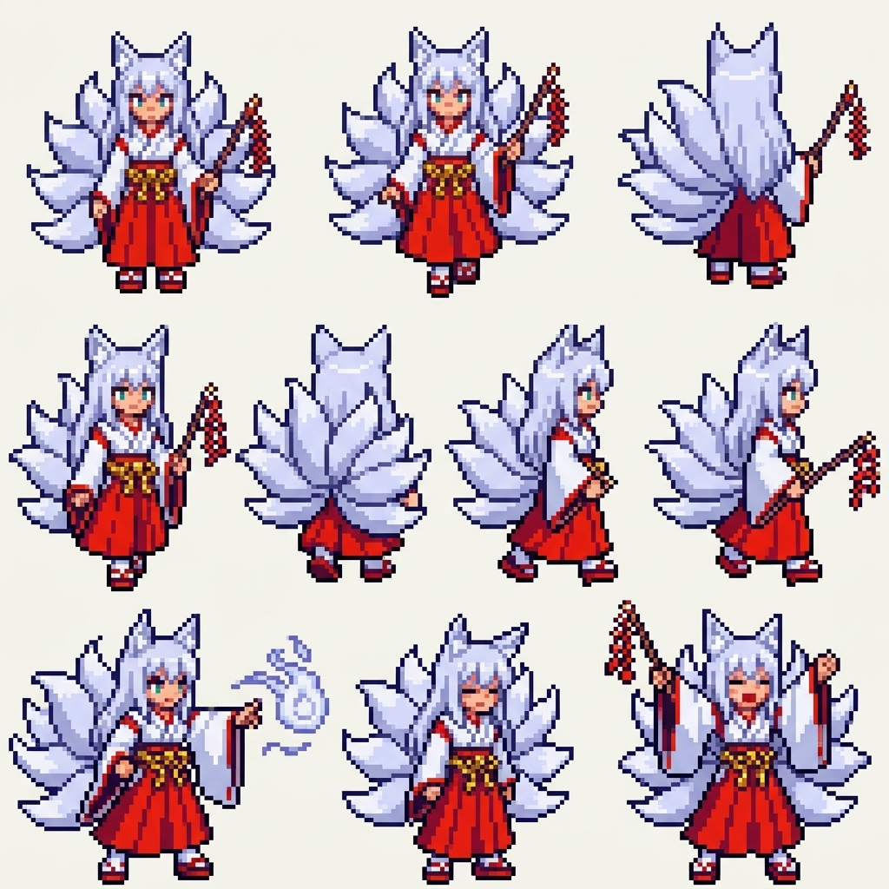
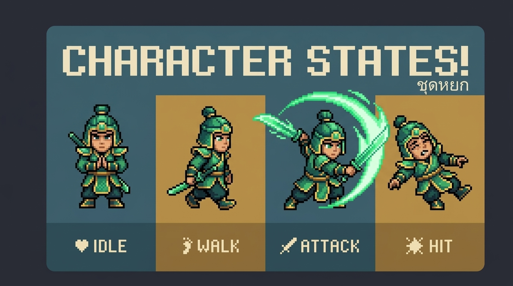
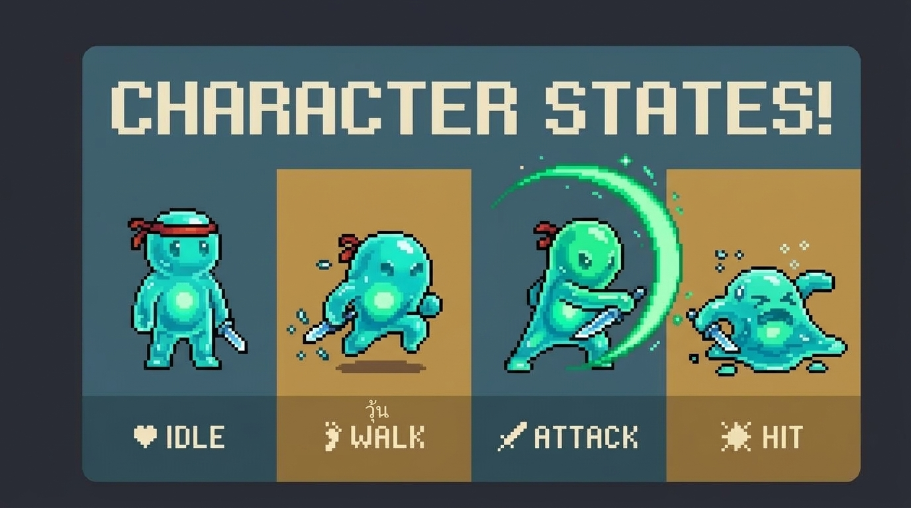

# 🎨 Character Design Concepts & Models (คลังงานออกแบบและโมเดลตัวละคร)

เอกสารสรุปคอนเซปต์และโมเดลตัวละครทั้งหมด ที่ยึดตามหลักโครงสร้าง สัดส่วน (Anatomy) และกฎของ Neo-Retro 16-bit / 32-bit Platformer

---

## 1. 👹 Oni Wandering Ronin (ยักษ์สาวซามูไรพเนจร)

* **Archetype:** ซามูไรสาวเผ่าโอนิ ดาบหนัก พเนจร
* **Silhouette:** เขาคู่สีเข้มโค้งชี้ขึ้นชัดเจน, ผมหยักศกหนาสีแดงเลือดหมูมีผ้าคาดศีรษะขาว, เสื้อฮาโอริสีดำ-แดงขลิบทอง ชายเสื้อขาดรุ่ย, คาตานะยาวสะพายหลัง
* **Animation Focus:** เส้นผมและชายเสื้อฮาโอริสะบัดตามแรงก้าวเดิน, ท่าฟันใช้วงสวิงดาบกว้างกว่าตัวละคร

---

## 2. 🥷 Tengu Wind Shinobi (นินจาการาสุเท็งงูสายลม)

* **Archetype:** นินจาอีกาเท็งงู เน้นความคล่องตัวและความเร็วสูง
* **Silhouette:** ทรงผมขนนกสีกรมท่า-ดำ พร้อมหูขนนก, ปีกขนนกคล้ายผ้าคลุมด้านหลัง, ผ้าพันคอยาวสีขาวพริ้วไหว, ชุดชิโนบิสีเขียวมรกตตัดทอง และมีดสั้นคู่
* **Animation Focus:** ท่า Dash และ Air-glide มีผ้าพันคอที่ปลิวสะบัดบอกทิศทางความเร็ว, โจมตีเร็วแบบ Multi-thrust

---

## 3. ⛩️ Kitsune Shrine Maiden / Miko (มิโกะจิ้งจอกเก้าหางศักดิ์สิทธิ์)

* **Archetype:** มิโกะจิ้งจอกขาว นักบวชวิญญาณแห่งศาลเจ้า
* **Silhouette:** หูจิ้งจอกสีขาวตั้งตรง, หางฟูนุ่มขนาดใหญ่ 9 หางด้านหลัง (แผ่เป็นรูปพัด), ชุดมิโกะสีขาวตัดแดงชาด (Hakama) พร้อมเชือกชิเมนาวะ, คทากระดิ่งปัดเป่าวิญญาณ
* **Animation Focus:** การกระเพื่อมของกลุ่มหางทั้ง 9 แบบ Sine-wave ในท่ายืนและเดิน, ท่าร่ายเวทลูกไฟจิ้งจอก

---

## 4. 🐉 Jade Dragon Warrior (นักรบหยกมังกร)

* **Archetype:** อัศวินมังกรหยกโบราณ
* **Silhouette:** เขามังกรหยกคู่, ชุดเกราะหยกเขียวมรกตตัดขอบทองคำ, ท่าเคลื่อนไหว 4 ทิศทาง (Front, Side, Back)
* **Animation Focus:** อาวุธหอกยาวมังกร และการแทงแบบทะลวงเกราะ

---

## 5. 💧 Slime Yokai Companion (สไลม์โยไกตัวช่วย)

* **Archetype:** สัตว์เลี้ยงภูติน้ำโยไก
* **Silhouette:** รูปร่างหยดน้ำโปร่งใส ดึ๋งดั๋ง พร้อมดวงตากลมโตและเขาเล็ก
* **Animation Focus:** แอนิเมชัน Squish & Stretch ขณะกระโดดและตกกระทบพื้น
