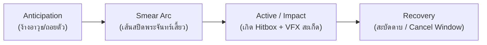

# คู่มืออ้างอิงท่าทางและระบบอนิเมชัน (Moveset & Animation Reference Manual)
## Merakintsugi Platformer Character Pack

> **เอกสารอ้างอิงทางเทคนิค:** รวบรวมและวิเคราะห์จังหวะการเคลื่อนไหว (Pacing), ช่วงเฟรม (Frame Ranges), การแตกเฟสโจมตี (Phase Breakdown in ms), หลักการแอนิเมชัน (Squash & Stretch, Body Tilt, VFX) และค่าพารามิเตอร์ที่แนะนำสำหรับนำไปพัฒนาใน Game Engine (สเกล 1x, Hitbox ~44px)  
> **แหล่งข้อมูลอ้างอิง:** Preview GIFs ใน `03_Action_GIFs_and_Images/`, Extracted Frames ใน `04_Extracted_Frames/`, ข้อมูลเวลาใน `06_Metadata_and_Doc/animation_timing_metadata.json`, และสเปกดีไซน์ใน `CHARACTER_DESIGN_ANALYSIS_GUIDE.md`

---

## 1. ข้อมูลจำเพาะทางเทคนิคและโครงสร้างแคนวาส (Technical Specifications)

* **ความละเอียดแคนวาสมาตรฐาน (Native Canvas):**
  * Base Actions (Idle, Walk, Run, Jump): **64 × 64 pixels** (Walk Canvas ดั้งเดิม 53 × 64 pixels)
  * Combat & VFX Expansions (Combos, Finisher, Air Dash): ขยายเป็น **96 × 96** หรือ **128 × 128 pixels** ตามระยะวงดาบและประกายพลังงาน
* **สัดส่วนและขนาด Hitbox ตัวละคร (1x Native Scale):**
  * ความสูงตัวละคร (Character Height): **40 – 46 pixels** (ค่าเฉลี่ยสมบูรณ์ **~44 pixels**)
  * ความกว้างตัวละคร (Character Width): **24 – 32 pixels**
  * สัดส่วนกายวิภาค: **Semi-Chibi Action Scale (1 : 2.8)** โดยแบ่งเป็น ศีรษะและกลุ่มผม ~16–18 px, ลำตัว ~14–16 px, ขาและรองเท้า ~14–16 px
* **โครงสร้างการแสดงผลใน Preview Assets:**
  * ภาพในชุดพรีวิวถูกขยายที่อัตราส่วน **4x Scale** (เช่น แคนวาส 160×200 พิกเซล ขยายเป็น 640×800 พิกเซล)
  * มีการจัดวางพื้นผิวกระจกสะท้อนเงาด้านล่าง (Reflective Surface floor) และมีลายน้ำระบุผู้สร้าง (Watermark) อยู่บริเวณกึ่งกลางพื้นหลัง ซึ่งใช้เป็น reference ดูจังหวะ/กลไกการเคลื่อนไหวเท่านั้น

---

## 2. ตารางรายการท่าทั้งหมดแยกตามไฟล์ (Complete Moveset Master Table)

การคำนวณเวลารวม (`Total ms`) ในตารางด้านล่างนี้คำนวณจาก `durations` รายเฟรมตาม `06_Metadata_and_Doc/animation_timing_metadata.json` อย่างแม่นยำทุกเสี้ยววินาที

| ลำดับ | ไฟล์ต้นฉบับ (`04_Extracted_Frames`) | ชื่อท่า / สถานะแอนิเมชัน | ช่วงเฟรม | จำนวนเฟรม | เฟรมดีเลย์ (Delay/FPS) | เวลารวม (ms) | คำอธิบายกลไกและการใช้งานในเกม |
| :---: | :--- | :--- | :---: | :---: | :---: | :---: | :--- |
| **1** | `gallery_01_idle_walk` | **Idle (Phase 1)** | `frame_001` – `frame_010` | 10 | 60ms (16.6 FPS) | **600** | ยืนหายใจ ลำตัวยืดขึ้น-ลง 1px ผมและเสื้อคลุมทิ้งตัว |
| | | **Walk Start (Transition 1)** | `frame_011` – `frame_012` | 2 | 60ms (16.6 FPS) | **120** | ถ่ายน้ำหนักก้าวเท้าแรกจากท่ายืนสู่ท่าเดิน |
| | | **Walk Cycle (Loop 1)** | `frame_013` – `frame_030` | 18 | 60ms (16.6 FPS) | **1,080** | เดินปกติ ยกเข่ามั่นคง แกว่งแขนและผมตามจังหวะก้าว |
| | | **Walk Stop (To Idle)** | `frame_031` – `frame_034` | 4 | 60ms (16.6 FPS) | **240** | ชะลอเท้า ดึงน้ำหนักกลับมาสู่จุดสมดุลเพื่อหยุดยืน |
| | | **Idle (Phase 2)** | `frame_035` – `frame_044` | 10 | 60ms (16.6 FPS) | **600** | ท่ายืนหายใจรอบที่สอง ก่อนเริ่มก้าวเดินอีกครั้ง |
| | | **Walk Start (Transition 2)** | `frame_045` – `frame_046` | 2 | 60ms (16.6 FPS) | **120** | ก้าวเท้าออกตัวรอบใหม่ |
| | | **Walk Cycle (Loop 2)** | `frame_047` – `frame_067` | 21 | 60ms (16.6 FPS) | **1,260** | ลูปเดินต่อเนื่องพร้อมเตรียมลดจุดศูนย์ถ่วงลงต่ำ |
| | | **Crouch Transition & Idle** | `frame_068` – `frame_076` | 9 | 60ms (16.6 FPS) | **540** | ย่อตัวลงต่ำ (Squash เหลือ 33-36px) นั่งยองหลบ |
| | | **Crouch Walk / Crawl** | `frame_077` – `frame_096` | 20 | 40ms (25.0 FPS) | **800** | ย่อตัวเดินคลานไปข้างหน้า ความสูงคงที่ ~40-44px |
| | **รวมไฟล์ 1** | | | **96** | | **5,360** | ครบสมบูรณ์ 100% ตรงตาม Metadata |
| **2** | `gallery_02_run_actions` | **Idle (Pre-run Stance)** | `frame_001` – `frame_010` | 10 | 60ms (16.6 FPS) | **600** | ท่ายืนเตรียมพร้อมก่อนสปรินต์ |
| | | **Run Start / Acceleration** | `frame_011` – `frame_014` | 4 | 40ms (25.0 FPS) | **160** | เอนตัวไปข้างหน้า 15° ถีบเท้าเร่งความเร็วต้น |
| | | **Run Cycle** | `frame_015` – `frame_020` | 6 | 40ms (25.0 FPS) | **240** | วิ่งเต็มสปีด ผมสะบัดราบไปด้านหลัง ลำตัวเอนต่ำ |
| | | **Turn / Skid Turnaround** | `frame_021` – `frame_024` | 4 | 40ms (25.0 FPS) | **160** | กลับตัว 180° หมุนตัวสับเท้าเปลี่ยนทิศทางกะทันหัน |
| | | **Brake / Deceleration Stop**| `frame_025` – `frame_027` | 3 | 40ms (25.0 FPS) | **120** | ส้นเท้ายึดพื้น เอนตัวไปข้างหลังเพื่อหยุดวิ่ง |
| | **รวมไฟล์ 2** | | | **27** | | **1,280** | ครบสมบูรณ์ 100% ตรงตาม Metadata |
| **3** | `gallery_03_jump_actions` | **Idle** | `frame_001` – `frame_010` | 10 | 60ms (16.6 FPS) | **600** | ท่ายืนนิ่งก่อนกระโดด |
| | | **Jump Ascend & Apex** | `frame_011` – `frame_018` | 8 | 40ms (25.0 FPS) | **320** | ย่อแล้วดีดตัวลอยขึ้นสู่อากาศจนถึงจุดสูงสุด (Apex) |
| | | **Fall (Descend)** | `frame_019` – `frame_022` | 4 | 40ms (25.0 FPS) | **160** | ทิ้งดิ่งลงตามแรงโน้มถ่วง ขาเหยียดเตรียมสัมผัสพื้น |
| | | **Land & Squash Recovery** | `frame_023` – `frame_032` | 10 | 40ms (25.0 FPS) | **400** | สัมผัสพื้น ย่อเข่ายุบลำตัวซับแรงกระแทกแล้วลุกยืน |
| | | **Idle (Mid-set Reset)** | `frame_033` – `frame_042` | 10 | 60ms (16.6 FPS) | **600** | ท่ายืนพักระหว่างชุดทดสอบการเคลื่อนไหว |
| | | **Double Jump / Air Flip** | `frame_043` – `frame_052` | 10 | 40ms (25.0 FPS) | **400** | ม้วนตัวหมุนกลางอากาศ 360° (Somersault Double Jump) |
| | | **Fall & Land to Slide** | `frame_053` – `frame_056` | 4 | 40ms (25.0 FPS) | **160** | ลงพื้นพร้อมทิ้งน้ำหนักไถลตัวราบไปข้างหน้าทันที |
| | | **Ground Slide** | `frame_057` – `frame_067` | 11 | 40ms (25.0 FPS) | **440** | สไลด์ลอดพื้น ความสูงยุบเหลือ 21-22px กว้าง 78px |
| | | **Slide Recovery / Stand** | `frame_068` – `frame_070` | 3 | 40ms (25.0 FPS) | **120** | ยันตัวลุกขึ้นยืนจากท่าสไลด์ |
| | | **Wall Cling / Slide (Entry)** | `frame_071` – `frame_076` | 6 | 40ms (25.0 FPS) | **240** | เข้าเกาะกำแพง มือและเท้ายันผนังด้านข้าง |
| | | **Wall Slide Hold (Friction)** | `frame_077` – `frame_086` | 10 | 40ms (25.0 FPS) | **400** | รูดเกาะกำแพงชะลอความเร็วตก (Wall Slide Loop) |
| | | **Wall Jump Push-off & Flip**| `frame_087` – `frame_098` | 12 | 60ms (16.6 FPS) | **720** | ถีบกำแพงกระโดดดีดตัวออกไปฝั่งตรงข้ามพร้อมหมุนตัว |
| | | **Air Dash / Recovery Glide** | `frame_099` – `frame_104` | 6 | 60ms (16.6 FPS) | **360** | พุ่งร่อนกลางอากาศปรับสมดุลก่อนลงพื้น |
| | **รวมไฟล์ 3** | | | **104** | | **4,920** | ครบสมบูรณ์ 100% ตรงตาม Metadata |
| **4** | `gallery_04_attacks` | **Idle** | `frame_001` – `frame_010` | 10 | 60ms (16.6 FPS) | **600** | ท่ายืนจับดาบพร้อมรบ |
| | | **Attack 1: Horizontal Slash** | `frame_011` – `frame_019` | 9 | 70ms (14.3 FPS) | **630** | ฟันดาบระดับอกแนวนอน รวดเร็ว คล่องตัว |
| | | **Attack 2: Overhead Slash** | `frame_020` – `frame_029` | 10 | 70ms (14.3 FPS) | **700** | งัดดาบฟันกวาดขึ้นด้านบนเป็นวงโค้งแนวตั้ง |
| | | **Heavy Attack / Spin Slash** | `frame_030` – `frame_044` | 15 | 60ms (16.6 FPS) | **900** | ชาร์จหมุนตัวฟันรอบทิศทาง วงดาบกว้างทรงพลัง |
| | | **Finisher Recovery / Sheathe**| `frame_045` – `frame_051` | 7 | 60ms (16.6 FPS) | **420** | สะบัดดาบเก็บเข้าฝัก ดึงตัวกลับท่าตั้งการ์ด |
| | **รวมไฟล์ 4** | | | **51** | | **3,250** | ครบสมบูรณ์ 100% ตรงตาม Metadata |
| **5** | `gallery_05_dodge_attacks` | **Idle** | `frame_001` – `frame_010` | 10 | 60ms (16.6 FPS) | **600** | ท่ายืนประจันหน้า |
| | | **Dodge / Backstep Evade** | `frame_011` – `frame_026` | 16 | 70ms (14.3 FPS) | **1,120** | ทิ้งน้ำหนักถอยหลังหลบการโจมตี (Invulnerable window) |
| | | **Evade Recovery & Spring** | `frame_027` – `frame_030` | 4 | 3×70ms + 1×60ms | **270** | ย่อเข่าสะสมแรงสปริงตัวพุ่งกลับไปข้างหน้า |
| | | **Counter Strike: Thrust Slash**| `frame_031` – `frame_033` | 3 | 60ms (16.6 FPS) | **180** | พุ่งแทง/ฟันสวนกลับฉับพลัน (Counter Hitbox) |
| | | **Counter Recovery & Reset** | `frame_034` – `frame_044` | 11 | 60ms (16.6 FPS) | **660** | สะบัดดาบหลังแทงสำเร็จ กลับสู่ท่ายืนปกติ |
| | **รวมไฟล์ 5** | | | **44** | | **2,830** | ครบสมบูรณ์ 100% ตรงตาม Metadata |
| **6** | `gallery_06_combos` | **Idle (Ready)** | `frame_001` – `frame_010` | 10 | 60ms (16.6 FPS) | **600** | ท่ายืนเตรียมออกคอมโบชุดใหญ่ |
| | | **Rapid Combo 1 (Horizontal)**| `frame_011` – `frame_017` | 7 | 30ms (33.3 FPS) | **210** | ฟันเฉือนระดับอกอย่างรวดเร็วเป็นจังหวะเปิด |
| | | **Rapid Combo 2 (Cross Arc)** | `frame_018` – `frame_021` | 4 | 30ms (33.3 FPS) | **120** | ตวัดดาบสวนเฉียงขึ้นตัดลำตัวคู่ต่อสู้ |
| | | **Rapid Combo 3 (Finisher Lunge)**| `frame_022` – `frame_027` | 6 | 30ms (33.3 FPS) | **180** | พุ่งทะยานฟันปิดฉาก ตัวละครเคลื่อนที่ไปข้างหน้า |
| | | **Combo Recovery & Sheathe** | `frame_028` – `frame_034` | 7 | 30ms (33.3 FPS) | **210** | ควงดาบเก็บเข้าฝักอย่างสง่างาม |
| | | **Idle (Return)** | `frame_035` – `frame_044` | 10 | 60ms (16.6 FPS) | **600** | ท่ายืนนิ่งหลังจบคอมโบ |
| | **รวมไฟล์ 6** | | | **44** | | **1,920** | ครบสมบูรณ์ 100% ตรงตาม Metadata |
| **7** | `gallery_07_special_moves` | **Idle** | `frame_001` – `frame_010` | 10 | 60ms (16.6 FPS) | **600** | ท่ายืนหน้าบันไดลิง |
| | | **Ladder Climb (Ascend Cycle)**| `frame_011` – `frame_060` | 50 | 50ms (20.0 FPS) | **2,500** | ไต่บันไดลิง หันหลังให้กล้อง สลับมือและเท้าต่อเนื่อง |
| | | **Ladder Dismount / Exit** | `frame_061` – `frame_078` | 18 | 40ms (25.0 FPS) | **720** | ดึงตัวขึ้นสู่ขอบบันไดด้านบนแล้วก้าวเท้าลงสู่พื้น |
| | | **Charge / Power-Up Pulse** | `frame_079` – `frame_102` | 24 | 40ms (25.0 FPS) | **960** | ย่อตัวรวบรวมลมปราณ/พลังงาน ลำตัวเปล่งออร่า |
| | | **Knockdown / Impact Hurt** | `frame_103` – `frame_130` | 28 | 40ms (25.0 FPS) | **1,120** | ถูกโจมตีกระเด็นลอยไปด้านหลังแล้วตกกระแทกพื้นนอนหงาย |
| | | **Get Up / Ground Recovery** | `frame_131` – `frame_158` | 28 | 40ms (25.0 FPS) | **1,120** | ยันแขนดึงตัวลุกขึ้นยืน (Wakeup invincibility window) |
| | | **Victory / Combat Stance** | `frame_159` – `frame_173` | 15 | 40ms (25.0 FPS) | **600** | สะบัดผม ตั้งการ์ดดาบมั่นคงแสดงความพร้อมรบ |
| | | **Idle (Return)** | `frame_174` – `frame_183` | 10 | 60ms (16.6 FPS) | **600** | กลับสู่ท่ายืนหายใจปกติ |
| | **รวมไฟล์ 7** | | | **183** | | **8,220** | ครบสมบูรณ์ 100% ตรงตาม Metadata |
| **8** | `body_basic_3_hit_combo` | **Idle** | `frame_001` – `frame_010` | 10 | 60ms (16.6 FPS) | **600** | ท่ายืนเตรียมคอมโบพื้นฐาน |
| | | **Hit 1: Horizontal Slash** | `frame_011` – `frame_019` | 9 | 2×20 + 7×40ms | **320** | ฟันหน้าตรงแนวนอน รวดเร็ว (Smear เฟรม 15) |
| | | **Hit 2: Low Sweep Lunge** | `frame_020` – `frame_032` | 13 | 5×20 + 8×40ms | **420** | สไลด์พุ่งกวาดดาบเฉียงขึ้น (Smear เฟรม 25) |
| | | **Hit 3: Overhead Finisher** | `frame_033` – `frame_064` | 32 | Dynamic (20-70ms) | **1,270** | กระโดดทุบดาบลงพื้น เกิดคลื่นกระแทก 2 ฝั่ง |
| | | **Recovery / Sheathe** | `frame_065` – `frame_074` | 10 | 9×60 + 1×20ms | **560** | สะบัดดาบเก็บเข้าฝัก ควันสลายตัว |
| | **รวมไฟล์ 8** | | | **74** | | **3,170** | ครบสมบูรณ์ 100% ตรงตาม Metadata |
| **9** | `body_5_hit_combo_variation`| **Idle** | `frame_001` – `frame_010` | 10 | 60ms (16.6 FPS) | **600** | ท่ายืนเตรียมคอมโบ 5 จังหวะ |
| | | **Hit 1: Horizontal Arc** | `frame_011` – `frame_019` | 9 | 2×20 + 7×40ms | **320** | ฟันเปิดแนวนอนความเร็วสูง |
| | | **Hit 2: Low Sweep Lunge** | `frame_020` – `frame_030` | 11 | 5×20 + 6×40ms | **340** | สไลด์พุ่งกวาดดาบเฉียงต่ำ |
| | | **Hit 3: Reverse Slash** | `frame_031` – `frame_038` | 8 | 8×40ms (25.0 FPS) | **320** | ฟันตวัดกลับแนวนอนในมุมตรงข้าม |
| | | **Hit 4: Rising Uppercut** | `frame_039` – `frame_044` | 6 | 6×40ms (25.0 FPS) | **240** | ตวัดดาบงัดขึ้น เสยเป้าหมายลอยขึ้นฟ้า |
| | | **Hit 5: Vertical Slam Finisher**| `frame_045` – `frame_094` | 50 | Dynamic (20-70ms) | **1,880** | ลอยตัวปักดาบลงพื้น ลำแสงสีเขียว/ฟ้าพุ่ง 6 ทิศ |
| | | **Idle (Return)** | `frame_095` – `frame_104` | 10 | 60ms (16.6 FPS) | **600** | ท่ายืนสมบูรณ์หลังจบคอมโบ |
| | **รวมไฟล์ 9** | | | **104** | | **4,300** | ครบสมบูรณ์ 100% ตรงตาม Metadata |
| **10**| `body_dodge_attack_combo` | **Idle** | `frame_001` – `frame_010` | 10 | 60ms (16.6 FPS) | **600** | ท่ายืนตั้งหลัก |
| | | **Dodge Roll & Counter Prep** | `frame_011` – `frame_036` | 26 | Dynamic (20-40ms) | **980** | กลิ้ง/ถอยหลบคมดาบศัตรู พร้อมง้างดาบสวน |
| | | **Counter Strike: Thrust** | `frame_037` – `frame_043` | 7 | 7×40ms (25.0 FPS) | **280** | พุ่งแทงสวนกลับระยะประชิดทันทีที่พ้นการหลบ |
| | | **Link: Aerial Leap & Flip** | `frame_044` – `frame_053` | 10 | 10×40ms (25.0 FPS)| **400** | กระโดดตีลังกากลางอากาศเพื่อเปลี่ยนมุมโจมตี |
| | | **Aerial Dive Slash** | `frame_054` – `frame_062` | 9 | Dynamic (30-60ms) | **370** | ทิ้งดิ่งฟันดาบลงจากกลางอากาศ |
| | | **Ground Impact & Shockwave** | `frame_063` – `frame_082` | 20 | Dynamic (20-70ms) | **680** | กระแทกพื้น เกิดคลื่นพลังงานและสะเก็ดหิน |
| | | **Post-Impact Recovery** | `frame_083` – `frame_096` | 14 | 14×40ms (25.0 FPS)| **560** | ดึงดาบออกจากพื้น สะบัดเก็บเข้าฝัก |
| | | **Idle (Return)** | `frame_097` – `frame_106` | 10 | 60ms (16.6 FPS) | **600** | ท่ายืนนิ่งจบกระบวนท่า |
| | **รวมไฟล์ 10** | | | **106** | | **4,470** | ครบสมบูรณ์ 100% ตรงตาม Metadata |
| **11**| `body_air_dash` | **Ground Idle (Pre-jump)** | `frame_001` – `frame_010` | 10 | 70ms (14.3 FPS) | **700** | ยืนตั้งหลักก่อนดีดตัวขึ้นสู่อากาศ |
| | | **Aerial Launch / Ascend** | `frame_011` – `frame_014` | 4 | 70ms (14.3 FPS) | **280** | พุ่งทะยานขึ้นสู่อากาศในแนวมุมสูง |
| | | **Air Dash 1 (Horizontal)** | `frame_015` – `frame_024` | 10 | 70ms (14.3 FPS) | **700** | พุ่งทะยานแนวนอนความเร็วสูง เกิด After-image |
| | | **Double Jump / Re-dash** | `frame_025` – `frame_034` | 10 | 70ms (14.3 FPS) | **700** | ม้วนตัวกลางอากาศและพุ่งต่ออีกระลอก |
| | | **Aerial Descent & Land** | `frame_035` – `frame_039` | 5 | 70ms (14.3 FPS) | **350** | ร่อนลงแตะพื้นพร้อมย่อเข่าซับแรงกระแทก |
| | | **Ground Recovery & Idle** | `frame_040` – `frame_049` | 10 | 9×70 + 1×20ms | **650** | ยืนขึ้นสู่ท่ายืนสงบนิ่งที่ปลายทาง |
| | **รวมไฟล์ 11** | | | **49** | | **3,380** | ครบสมบูรณ์ 100% ตรงตาม Metadata |
| **12**| `cover_idle` | **Cover Idle Showcase** | `frame_001` – `frame_020` | 20 | 30ms (33.3 FPS) | **600** | ท่ายืนหายใจแบบลูปความเร็วสูงสำหรับหน้าปก |
| | **รวมไฟล์ 12** | | | **20** | | **600** | ครบสมบูรณ์ 100% ตรงตาม Metadata |
| **13**| `footer_cheer` | **Victory Cheer / Wave** | `frame_001` – `frame_020` | 20 | 30ms (33.3 FPS) | **600** | ท่ากระโดดโบกมือแสดงความยินดี/ฉลองชัยชนะ |
| | **รวมไฟล์ 13** | | | **20** | | **600** | ครบสมบูรณ์ 100% ตรงตาม Metadata |

---

## 3. การแตกเฟสท่าโจมตีอย่างละเอียด (Detailed Attack Phase Breakdown)

สูตรโครงสร้างแอนิเมชันการโจมตีระดับ High-End Action แตกออกเป็น 4 ระยะเสมอ:
```
Anticipation (ย่อ/ง้าง) ──> Smear Arc (วงดาบยืด/สปีดสูงสุด) ──> Active Impact (ฮิตบ็อกซ์สัมผัส) ──> Recovery (สะบัดเก็บ/Cancel)
```



### ตารางแจกแจงเฟสท่าโจมตีรายท่า (Phase Breakdown in Milliseconds)

| ท่าโจมตี (Attack Name) | ไฟล์อ้างอิง | Anticipation (ms / เฟรม) | Smear Arc (ms / เฟรม) | Active / Impact (ms / เฟรม) | Recovery (ms / เฟรม) | รวมเวลาโจมตี (ms) | จุดกด Cancel สู่ท่าถัดไป |
| :--- | :--- | :---: | :---: | :---: | :---: | :---: | :--- |
| **Ground Attack 1 (Horizontal)** | `gallery_04_attacks` | **210 ms** (3F: 11-13) | **70 ms** (1F: 14) | **140 ms** (2F: 15-16) | **210 ms** (3F: 17-19) | **630 ms** | เฟรม 17 (ทันทีที่พ้น Active) |
| **Ground Attack 2 (Upward)** | `gallery_04_attacks` | **210 ms** (3F: 20-22) | **140 ms** (2F: 23-24)| **140 ms** (2F: 25-26) | **210 ms** (3F: 27-29) | **700 ms** | เฟรม 27 |
| **Heavy Charge Spin Slash** | `gallery_04_attacks` | **300 ms** (5F: 30-34) | **120 ms** (2F: 35-36)| **180 ms** (3F: 37-39) | **720 ms** (12F: 40-51)| **1,320 ms** | เฟรม 45 (จังหวะเก็บดาบ) |
| **Dodge-Counter Thrust** | `gallery_05_dodge_attacks` | **1,390 ms** (Dodge 20F: 11-30) | **60 ms** (1F: 31) | **120 ms** (2F: 32-33) | **660 ms** (11F: 34-44)| **2,230 ms** | เฟรม 34 |
| **Rapid Combo - Hit 1** | `gallery_06_combos` | **90 ms** (3F: 11-13) | **30 ms** (1F: 14) | **60 ms** (2F: 15-16) | **30 ms** (1F: 17) | **210 ms** | เฟรม 17 (Cancel ไป Hit 2) |
| **Rapid Combo - Hit 2** | `gallery_06_combos` | **30 ms** (1F: 18) | **30 ms** (1F: 19) | **30 ms** (1F: 20) | **30 ms** (1F: 21) | **120 ms** | เฟรม 21 (Cancel ไป Hit 3) |
| **Rapid Combo - Hit 3 (Finisher)** | `gallery_06_combos` | **30 ms** (1F: 22) | **30 ms** (1F: 23) | **60 ms** (2F: 24-25) | **270 ms** (9F: 26-34) | **390 ms** | เฟรม 28 (Dash Cancel ได้) |
| **3-Hit Combo - Hit 1** | `body_basic_3_hit_combo` | **120 ms** (4F: 11-14) | **40 ms** (1F: 15) | **40 ms** (1F: 16) | **120 ms** (3F: 17-19) | **320 ms** | เฟรม 17 (Cancel ไป Hit 2) |
| **3-Hit Combo - Hit 2** | `body_basic_3_hit_combo` | **100 ms** (5F: 20-24) | **40 ms** (1F: 25) | **40 ms** (1F: 26) | **240 ms** (6F: 27-32) | **420 ms** | เฟรม 28 (Cancel ไป Hit 3) |
| **3-Hit Combo - Hit 3 (Slam)** | `body_basic_3_hit_combo` | **290 ms** (6F: 33-38) | **40 ms** (1F: 39) | **120 ms** (3F: 40-42) | **820 ms** (22F: 43-64)| **1,270 ms** | เฟรม 50 (หลังคลื่นกระแทกหมด) |
| **5-Hit Combo - Hit 1** | `body_5_hit_combo_variation` | **120 ms** (4F: 11-14) | **40 ms** (1F: 15) | **40 ms** (1F: 16) | **120 ms** (3F: 17-19) | **320 ms** | เฟรม 17 (Cancel ไป Hit 2) |
| **5-Hit Combo - Hit 2** | `body_5_hit_combo_variation` | **100 ms** (5F: 20-24) | **40 ms** (1F: 25) | **40 ms** (1F: 26) | **160 ms** (4F: 27-30) | **340 ms** | เฟรม 27 (Cancel ไป Hit 3) |
| **5-Hit Combo - Hit 3** | `body_5_hit_combo_variation` | **40 ms** (1F: 31) | **40 ms** (1F: 32) | **40 ms** (1F: 33) | **200 ms** (5F: 34-38) | **320 ms** | เฟรม 34 (Cancel ไป Hit 4) |
| **5-Hit Combo - Hit 4** | `body_5_hit_combo_variation` | **80 ms** (2F: 39-40) | **40 ms** (1F: 41) | **40 ms** (1F: 42) | **80 ms** (2F: 43-44) | **240 ms** | เฟรม 43 (Cancel ไป Hit 5) |
| **5-Hit Combo - Hit 5 (Geyser)** | `body_5_hit_combo_variation` | **400 ms** (10F: 45-54)| **80 ms** (2F: 55-56) | **840 ms** (24F: 57-80)| **560 ms** (14F: 81-94)| **1,880 ms** | เฟรม 81 (หลังลำแสง 6 ทิศ) |
| **Dodge-Attack: Lunge Counter** | `body_dodge_attack_combo` | **980 ms** (Dodge 26F: 11-36)| **40 ms** (1F: 37) | **80 ms** (2F: 38-39) | **160 ms** (4F: 40-43) | **1,260 ms** | เฟรม 41 (Cancel สู่ท่าโดด) |
| **Dodge-Attack: Dive Slam** | `body_dodge_attack_combo` | **400 ms** (Leap 10F: 44-53)| **120 ms** (3F: 54-56)| **930 ms** (Dive 26F: 57-82)| **560 ms** (14F: 83-96)| **2,010 ms** | เฟรม 83 (เมื่อยืนขึ้น) |

---

## 4. ข้อสังเกตเชิงลึกด้าน Animation Principles, สรีระ และ VFX

### 4.1 กลไก Squash & Stretch (การยุบและยืดตัว)
1. **Jump Launch & Somersault Flip:**
   * เฟรมดีดตัว (Jump Launch): ลำตัวและขาถูกยืดออก (Stretch) เพิ่มความสูงจากปกติ 44px เป็น 53-56px ตามแนวดิ่ง
   * เฟรมม้วนตัว (Air Somersault / Double Jump): ตัวละครม้วนเป็นก้อนกลมทรงรี (Squash) ลดความสูงเหลือ ~38-41px ก่อนจะยืดเหยียดขาเมื่อเข้าสู่จุดสูงสุด
2. **Landing Impact:**
   * เมื่อเท้าแตะพื้น ตัวละครจะยุบลำตัวลงทันที (Squash) โดยความสูงลดลงจาก 44px เหลือเพียง **30–33 pixels** (ยุบตัวลงถึง **~28-32%**) ในช่วงเวลาสั้น 80-120ms เพื่อแสดงน้ำหนักการตกกระทบที่หนักแน่น ก่อนจะเด้งตัวกลับมาสู่ระดับปกติ
3. **Ground Slide (Extreme Low Profile Squash):**
   * ความสูงลดลงเหลือเพียง **21 – 22 pixels** (ยุบตัวลงมากกว่า **50%**) ในขณะที่แนวนอนยืดขนานไปกับพื้นกว้างถึง **76 – 79 pixels** ซึ่งช่วยลด Hitbox หลบกระสุนหรือสิ่งกีดขวางระดับกลางได้อย่างสมบูรณ์แบบ
4. **Attack Anticipation & Smear Arc:**
   * จังหวะง้างดาบ (Anticipation) ตัวละครจะย่อเข่ายุบตัวลงเล็กน้อย (Squash 2-3px) สะสมแรงดีด
   * จังหวะฟัน (Smear Frame) แขนและใบดาบจะยืดขยายออก (Stretch) เกินสัดส่วนจริงชั่วขณะ (ความยาวดาบเพิ่มขึ้นเป็น 40-50px) เพื่อสร้างเส้นสปีดนำสายตา

### 4.2 การเอียงตัวและการถ่ายน้ำหนัก (Body Tilt, Lean & Weight Shift)
1. **Run (การวิ่งไปข้างหน้า):**
   * ลำตัวส่วนบนเอียงไปข้างหน้าประมาณ **12° – 15°** นำหน้าจุดสัมผัสของเท้า เพื่อแสดงถึงแรงผลักและโมเมนตัมที่พุ่งไปข้างหน้า
   * กลุ่มผมหนาสีลาเวนเดอร์ปลิวไปข้างหลังในแนวระนาบเกือบ 180°
2. **Turn (การกลับตัว 180°):**
   * ลำตัวจะหมุนผ่านแกนกลาง (Pivot Axis) โดยเท้าข้างหนึ่งจะขัดกับทิศทางเดิมเพื่อถ่ายน้ำหนักกลับด้าน
   * กลุ่มผมและชายเสื้อจะพองตัวกว้างขึ้นและสะบัดข้ามแกนกลาง เกิดการเคลื่อนไหวแบบ S-Curve
3. **Brake (การเบรกหยุด):**
   * ลำตัวเอนกลับไปด้านหลังประมาณ **-10° ถึง -12°** ส้นเท้ายันพื้นอย่างมั่นคง เส้นผมสะบัดเลยหัวมาข้างหน้าเล็กน้อยตามแรงเฉื่อย (Overshoot & Settle)
4. **Combat Lunges & Counter Attacks:**
   * ใน Hit 2 (Low Sweep) ตัวละครโน้มลำตัวลงต่ำและพุ่งไปข้างหน้า +10 ถึง +12 พิกเซล
   * ในท่า Dodge ตัวละครถ่ายน้ำหนักลงที่สะโพกหลัง 70% และง้างตัวพร้อมพุ่งสปริงตัวสวนกลับ (Counter Spring)

### 4.3 การเคลื่อนไหวทุติยภูมิ (Secondary Motion & Follow-through)
* **เส้นผมก้อนใหญ่ (Lavender Clumps):** ขยับตามกฎ Follow-through โดยมีความล่าช้า (Lag) กว่าการเคลื่อนไหวของกระดูกสันหลังและศีรษะ **1 – 2 เฟรม** เมื่อตัวละครลงสู่พื้น ผมจะสะบัดขึ้นและทิ้งตัวลงช้ากว่า
* **ชายเสื้อคลุมกิโมโนและผ้าคาดเอว (Indigo Coat & Red Sash):** พริ้วไหวตามแรงเฉื่อยและทำหน้าที่เป็น **Vector Indicator** บอกทิศทางการเคลื่อนไหวและความเร็วของผู้เล่นตลอดเวลา

### 4.4 เอฟเฟกต์ภาพ สี และรูปทรง (VFX Geometry, Palette & Hierarchy)
1. **วงดาบเสี้ยวพระจันทร์ (Solid Crescent Blade Arcs):**
   * วงดาบคมกริบแบบ Solid (ไม่ใช้ Blur เบลอพิกเซล) รูปทรงพระจันทร์เสี้ยวหนาตรงกลางและเรียวแหลมที่ปลาย
   * **ลำดับสี (Layering Ramp):** แกนกลางดาบสีขาวบริสุทธิ์ (`#FFFFFF`) ล้อมรอบด้วยออร่าสีฟ้าเรืองแสง (`#97C0FF`) ตัดขอบนอกด้วยสีน้ำเงินเข้ม (`#0321BC`) และละอองสลายตัวสีคราม (`#1C154D`)
2. **คลื่นกระแทกพื้นสมมาตร (Symmetrical Ground Shockwave):**
   * ใน Hit 3 ของ 3-Hit Combo เกิดกลุ่มควันและประกายไฟระเบิดออกสองข้างซ้าย-ขวาอย่างสมมาตร สูง ~18-24px กว้าง ~60px
3. **ลำแสงปะทุแนวดิ่ง 6 ทิศ (6-Spoke Energy Geyser):**
   * ในท่า Vertical Ground Slam ของ 5-Hit Combo ปลายดาบปักลงพื้น เกิดลำแสงทรงแหลมสีขาว-เขียวมรกต/เทอร์ควอยซ์ (`#2AE0A8` / `#FFFFFF`) พุ่งกระจายขึ้นด้านบน 6 แฉก พร้อมละอองหินกระเด็น
4. **เงาตามตัวกลางอากาศ (Ghost Trails / After-images):**
   * ในท่า Air Dash มีการวาง Sprite เงาของตัวละครโปร่งแสง (Alpha 30-50%) ค้างไว้ด้านหลัง 2-3 ช่วง เพื่อสร้างความรู้สึกของความเร็วระดับเหนือเสียง

---

## 5. ข้อแนะนำค่าพารามิเตอร์สำหรับนำไปเซ็ตในเกม (In-Game Parameter Recommendations)

> ข้อมูลอ้างอิงสำหรับโปรเจกต์ 2D Platformer / Metroidvania ที่สเกล **1x (ตัวละครสูง ~44 พิกเซล, Tile Size 16×16 หรือ 32×32 พิกเซล)**

### 5.1 ตารางค่าความเร็วและการเคลื่อนที่ (Kinematic Values)

| กลไกการเคลื่อนที่ | ความเร็วที่แนะนำ (px/s) | อัตราเร่ง / ความหน่วง | หมายเหตุสำหรับเซ็ตใน Character Controller |
| :--- | :---: | :---: | :--- |
| **Walk Speed (เดินปกติ)** | **70 – 85 px/s** | ทันที (Instant) | เดินสำรวจ เข้ากับรอบขา 60ms/frame (~16 FPS) |
| **Run Speed (วิ่งสปรินต์)** | **190 – 230 px/s** | เร่งถึง Max ใน 160ms | ความเร็วหลักในการเล่นเกมแอ็กชัน (เคลื่อนที่ ~4.5 เท่าตัวละคร/วินาที) |
| **Crouch Walk (ย่อตัวเดิน)**| **45 – 55 px/s** | ทันที | ลอดสิ่งกีดขวาง ลดเสียงฝีเท้า |
| **Ground Slide (สไลด์พื้น)**| **300 px/s → 80 px/s**| Friction: 500 px/s² | ความเร็วเริ่มต้นสูงแล้วค่อยๆ ชะลอหยุดตลอดระยะเวลา 440ms |
| **Jump Initial Velocity** | **-380 ถึง -420 px/s**| แรงโน้มถ่วงกำหนด | ลอยตัวสูงประมาณ 90–110px (~2.3 เท่าของตัวละคร) ใช้เวลาลอย 320ms |
| **Gravity Scale (แรงโน้มถ่วง)**| **950 – 1,150 px/s²** | คงที่ (Fall clamp -600px/s)| สร้างจังหวะการตกที่กระชับ ไม่รู้สึกลอยเคว้ง (Snappy Game Feel) |
| **Wall Slide (รูดกำแพง)** | **60 – 75 px/s** | รูดลงสม่ำเสมอ | ชะลอความเร็วตกจากปกติ เพื่อให้ผู้เล่นเล็งจังหวะเกาะ/กระโดด |
| **Wall Jump Push-off** | X: **±260 px/s**, Y: **-360 px/s**| ดีดตัวออก 45° | บังคับทิศทางตรงข้ามผนัง ลอยตัวต่อเนื่อง 720ms |
| **Air Dash Speed (พุ่งกลางอากาศ)**| **480 – 550 px/s** | ลอยตัวแนวนอน (Gravity = 0)| พุ่งตรงแนวนอน ไร้แรงโน้มถ่วงชั่วคราวตลอดระยะพุ่ง |
| **Ladder Climb (ไต่บันได)** | **80 – 95 px/s** | ทันที (แนวดิ่ง) | เคลื่อนที่ขึ้น-ลงตามแนวบันไดลิง ลำตัวล็อกแกน X |

### 5.2 ตารางระยะพุ่งและระยะการเคลื่อนตัว (Dash & Displacement Distances)

| แอ็กชัน | ระยะพุ่งสุทธิที่สเกล 1x | พิกเซลเทียบกับตัวละคร (~44px) | การปรับแต่งในเกมเพลย์ |
| :--- | :---: | :---: | :--- |
| **Ground Slide Distance** | **95 – 115 px** | ~2.2 – 2.6 เท่าของความสูง | ใช้สำหรับสไลด์ลอดช่องแคบขนาด 1 Tile (16 หรือ 32px) |
| **Air Dash Distance** | **130 – 165 px** | ~3.0 – 3.7 เท่าของความสูง | ใช้ข้ามเหวลึกหรือข้ามหัวศัตรูขนาดใหญ่ |
| **Combo Hit 2 Lunge** | **+12 – 16 px** | ~0.3 เท่าของความสูง | ดึงตัวละครเข้าหาเป้าหมายอัตโนมัติ (Micro-lunge) |
| **Combo Hit 3/Finisher Lunge** | **+20 – 28 px** | ~0.5 – 0.6 เท่าของความสูง | ปิดฉากคอมโบพร้อมสร้างระยะห่างที่ปลอดภัย |
| **Dodge Backstep Distance** | **-35 – 45 px** | ~0.8 – 1.0 เท่าของความสูง | ถอยฉากหลบระยะสวิงของศัตรู |
| **Counter Thrust Lunge** | **+40 – 50 px** | ~1.0 – 1.1 เท่าของความสูง | พุ่งทะยานแทงกลับไปยังจุดเดิมที่ศัตรูยืนอยู่ |

### 5.3 ตารางระยะเวลาอมตะ (Invulnerability Frames / i-frames)

| สกิล / แอ็กชัน | ระยะเวลา i-frame | ช่วงเฟรมที่มีผล | วัตถุประสงค์และการประยุกต์ใช้ |
| :--- | :---: | :---: | :--- |
| **Ground Slide** | **160 – 200 ms** | 4 – 5 เฟรมแรกของการสไลด์ | หลบกระสุนระดับกลางและหลบการสัมผัสตัวศัตรูขณะสไลด์ |
| **Dodge Backstep / Roll** | **200 – 260 ms** | เฟรมที่ 3 ถึงเฟรมที่ 9 ของท่าหลบ | หน้าต่างหลบหลีกหลัก (Generous Evade Window) สำหรับเกมแนว Action RPG |
| **Counter Strike Window**| **120 ms** | เฟรมที่ 31-33 (ช่วง Active) | มี Hyper-Armor (ต้านทานการชะงัก) ระหว่างการแทงสวน |
| **Air Dash** | **120 – 150 ms** | เฟรมที่ 2 ถึงเฟรมที่ 5 ของการพุ่ง | ทะลุผ่านตัวศัตรูและโปรเจกไทล์กลางอากาศ |
| **Wakeup Ground Recovery**| **250 – 300 ms** | ทันทีที่ลุกขึ้นยืน (Get Up) | ป้องกันการโดนโจมตีซ้ำซ้อนขณะลุกจากพื้น (Okizeme / Stun-lock Protection) |

### 5.4 ข้อแนะนำเพิ่มเติมด้าน Game Feel & Combat Tuning
1. **Hitstop / Freeze Frames:** เมื่อดาบฟันโดนเป้าหมาย (Active Phase) ให้หยุดแอนิเมชันของทั้งตัวละครและศัตรูเป็นเวลา **40 – 60ms (2-3 เฟรม)** สำหรับการฟันธรรมดา และ **80 – 100ms** สำหรับ Finisher เพื่อให้รู้สึกถึงเนื้อสัมผัสและแรงปะทะของใบดาบ
2. **Camera Shake:** ใส่แรงสั่นหน้าจอแบบแนวตั้ง (Vertical Trauma) ขนาด 2-4px ในจังหวะ Hit 3 ของ 3-hit combo และ 5-8px ในจังหวะ Vertical Ground Slam ของ 5-hit combo
3. **Input Buffering Window:** เปิดระบบจำปุ่มล่วงหน้า (Buffer) กว้าง **120 – 150ms** ก่อนที่แอนิเมชันจะเข้าสู่ Cancel Window เพื่อให้ผู้เล่นกดคอมโบล่วงหน้าได้อย่างไหลลื่น ไม่สะดุด
